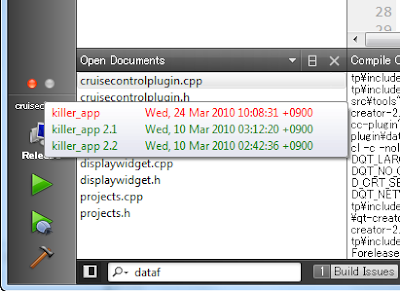
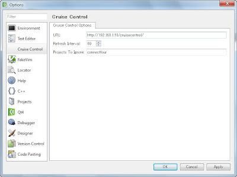

+++
title = "A CruiseControl monitor for QtCreator"
slug = "2010-07-05-a-cruisecontrol-monitor-for-qtcreator"
published = 2010-07-05T17:39:00.001000+09:00
author = "David Dibben"
tags = []
+++
We use CruiseControl to run automatic builds after every commit and I
thought it would be nice to monitor the build status from within
QtCreator. I also wanted to try creating a simple QtCreator plugin to
see how easy it would be to extend it. I already use the Firefox add-on
to monitor CruiseControl which does all that I need for a monitor so I
just wanted to port that to work in QtCreator.  The plugin adds a
red/green icon in the left hand bar to indicate the build status and a
tooltip to show the status of individual builds.  
  

  
The tutorial from VCreateLogic was very helpful setting up a basic
plugin.  This tutorial describes how to set up a project, how to add
menu items or new settings. So the basic configuration was
straightforward.  
  

  
The Welcome plugin which is part of QtCreator has a class for getting
rss feeds. This formed the base for getting the data from the
CruiseControl server. The main change required was an update to how the
xml is parsed. Also, my first version worked fine when getting data from
a test file but would not get data from the server. The original does
not set the port, since I assume all normal rss feeds use the default
port 80, but our CruiseControl server does not use port 80.  Once
discovered this was trivial to fix.  
  
The hardest part was finding out how to add the display widgets to the
left hand bar in QtCreator.  A bit of poking around found a modemanager
which manages the widgets. That seems to work but I am worried about API
changes in future versions since there seems to be no official
documentation for the API.  
  
The source for the plugin is available on
http://code.google.com/p/qtcreator-cc-plugin/  
  
At the moment only the monitoring function is implemented.  Hopefully I
will be able to find time to add functions to restart or stop builds
from a context menu.
