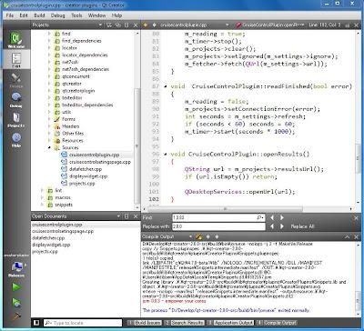
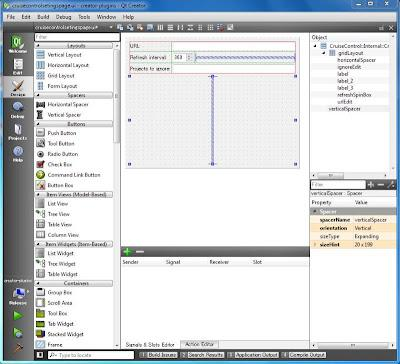
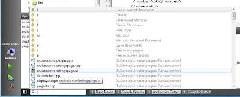

+++
title = "Qt Creator: A multiplatform IDE for creating Qt applications"
slug = "2010-07-05-qt-creator-a-multiplatform-ide-for-creating-qt-applications"
published = 2010-07-05T15:26:00.001000+09:00
author = "David Dibben"
tags = [ "QtCreator", "Qt",]
+++
[QtCreator](http://qt.nokia.com/products) is a powerful integrated
development environment from Nokia for creating applications with C++
and [Nokia’s Qt Framework](http://qt.nokia.com/). It is available on all
the desktop platforms supported by Qt (Windows, Linux and Mac).
QtCreator can be used with either gcc or the Microsoft C++ compiler on
Windows and the integrated debugger uses gdb or cdb depending on the
compiler.  

  
When QtCreator was released there were quite a few comments asking why
another IDE was needed; why not just use VisualStudio, it is powerful
mature and the \`industry standard.’ Having tried to use Visual Studio
in the past and now having used QtCreator for a couple of months the
answer is clear.  If you are doing development with Qt then QtCreator is
a much better environment.  This is principally because it is tailored
specifically to Qt development so supports Qt directly and is not
encumbered by masses of features which are not needed for C++
development.  
  
•    Supports Qt project files so you don’t have to struggle with two
different project management systems.  
•    Has Qt Designer embedded directly into the IDE.  
•    Good support for source control systems.  
•    Built in help for Qt.  
•    Simple project settings  
•    Multi-platform.  
  
  

  
The multiplatform nature of Qt is a big advantage for me. I now have
identical development environments on both Windows and Linux, so
switching between them is easy. If there is a bug which only shows up on
the Windows version I can easily debug it on Windows, then switch back
to Linux to run valgrind.  
  

  
One of the features I really like in QtCreator is the locator bar.
Opening files in an IDE has always been an issue for me. The file open
dialog is so slow, and having to search through a large tree of files
also takes forever. I like to be able to just type the name of the file,
preferably with some form of auto-completion. With QtCreator this is
possible. Ctrl-K takes you to the multi-function locator bar then just
typing the name of the file will show a list of matches, hit enter and
the file opens in the editor. It takes just a couple of seconds to open
any file in the project, without having to take your hands off the
keyboard.  
  
The code navigation and search function is also very well done. There
are function keys for header-source switching and for following symbols
to definitions. One of the more useful functions is “Find usages” which
searches the code model for uses of a particular function. The searches
based on the code model are almost instantaneous even with a large
project. There is also a multi-file full text search which is a bit
slower.  
The code editor has all the features you would expect, syntax
highlighting, code folding and auto-completion. It is quite similar to
Kate, which I used for a long time.  The only thing I miss is the block
selection mode.  
  
However, QtCreator is not as mature as some of the other IDEs, being
much newer and does have some inconveniences. Starting the debugger with
a large program seems slow, much slower than VisualStudio for the same
executable. So far this has not been a big problem for me as I don’t use
the debugger a great deal.  
When a large project is loaded QtCreator seems to use lots of memory. If
this gets swapped out due to some other operation on the machine then
switching back to QtCreator can take several seconds with the interface
stops responding for some time. This happens on both Windows and
Linux.  
  
There are also a few more minor annoyances  
•    The diff viewer with the source control integration is rather
basic  
•    There is no support for “code snippets” – the source directory has
a “dead” plugin and version 2.0 has some code-paster support based on
shared files.  
  
But it is likely that these will be improved in the future. Also,
QtCreator supports plugins for extending the functionality. In fact most
of the built-in functions are actually implemented via plugins. So far I
have not found many 3rd party plugins but I would expect more to appear.
