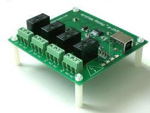
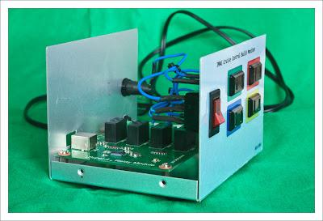
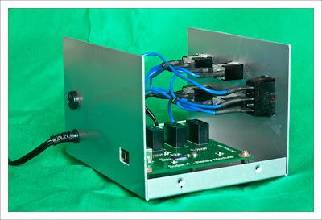

+++
title = "A monitor for Cruise Control"
slug = "2011-03-19-a-monitor-for-cruise-control"
published = 2011-03-19T13:37:00+09:00
author = "David Dibben"
tags = []
+++
I have wanted to build a monitor for our [Cruise
Control](http://cruisecontrol.sourceforge.net/) build server ever since
I heard about the use of lava lamps to report the build status. The
“easy” way seems to be to use an [X10
automation](http://pragmaticautomation.com/cgi-bin/pragauto.cgi/Monitor/Devices/BubbleBubbleBuildsInTrouble.rdoc)
system but unfortunately I have not been able to find that for sale in
Japan. (It probably conflicts with local radio licensing laws. )

  

Our builds have been staying broken for tool long. The email
notification  does not seem to encourage the fixing of the build. We
definately needed something more obvious to show the build status. So
when I recently found that there was a [4-way USB relay
board](http://www.emx.net.au/super4usbrelay.htm) available at a fairly
reasonable price from [Elefine](http://www.elefine.jp/) I decided to
build my own monitor. The hard part is controlling the power from the
computer and the relay board takes care of that. Once I got the board
all I needed to do was put it in a case and create some driver software
to control it.

  

  

  

Fitting the board into a box and wiring it up was fairly simple.
Unfortunately the USB port on the relay board is flush with the edge of
the circuit board. This means that a fairly large hole is needed in the
case to take the USB plug which looks a bit messy. 

  

  

  

  

For the lamps I decided not to use lava lamps because they will have to
sit on the desk in the office and they tend to run very hot.  Instead I
have adapted a small globe light, taking out the normal bulb and
replacing it with two separate lights, one red and one green.

  

For the software I had already made a cruise control monitor plugin for
QtCreator so I had most of the code already. All that was needed was to
add code to switch the relays on and off depending on the build status.
I tried to use the DLL which is provided by emx for the relay board but
that did not work well – causing the program to crash on exit. So
instead the code uses their command line utility for controlling the
board.

  

  

  

  

