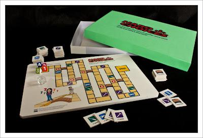

+++
title = "Hard Choices"
slug = "2011-04-03-hard-choices"
published = 2011-04-03T15:00:00.001000+09:00
author = "David Dibben"
tags = []
+++
The [Hard Choices board
game](http://www.sei.cmu.edu/architecture/tools/hardchoices/) from the
Software Engineering Institute is a game designed to teach the effect of
technical debt in software development. Players choose between taking a
shortcut or taking the "long way" and gathering more tools. Shortcuts
incur a -1 movement penalty on subsequent turns unless one turn is spent
"refactoring."  
  
An interesting suggestion from the [Facilitator's
guide](http://www.sei.cmu.edu/library/abstracts/whitepapers/hard-choices-game-explained-v1-0.cfm)
is to play multiple rounds, keeping the shortcut and tools cards from
the previous round. This simulates a second release where shortcuts from
the first round will continue to slow development.  
  
I want to play this with my development team but I am not sure how well
the will take to playing a dice game in the office. The discussion
following the game is likely to be the most important part.  
  

The game itself is provided as a PDF download to print out. Just
printing it out seemed a bit too simple so I printed it on some [ink jet
films](http://www.a-one.co.jp/product/search/detail.php?id=28874) and
stuck the board on a piece of poystyrene board and the tool cards onto
some thick card.
