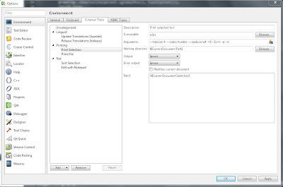

+++
title = "Printing from QtCreator"
slug = "2011-04-05-printing-from-qtcreator"
published = 2011-04-05T22:32:00+09:00
author = "David Dibben"
tags = []
+++
Why are the printing functions from most IDEs so bad? OK so I have not
really compared the printing function in many IDEs, but the ones that I
have used hardly offer any control over the printing at all and print in
a large font.  I do like to read through listings on paper and to make
notes on the listing  when trying to understand code or planning some
modifications. But, I don't like priniting out pages and pages just to
get a single function.  
  
For whole files, I have been using
[a2ps](http://www.gnu.org/software/a2ps/). It can print multiple pages
per sheet, supports two sided printing and produces readable listings
with a small font. However, prinitng selected text was more difficult.  
  
Now, QtCreator has support for external tools so I can print both whole
files and selected text from within QtCreator but using a2ps. To print a
file I just configured an external tool with the command line:  
/usr/bin/a2ps
--tabsize=4 --sides=tumble --medium=a4 -f8 -Ec++ 
--center-title=${CurrentProject:FilePath} -g -d
"%{CurrentDocument:FilePath}"  
  
To print a selection is similar, but instead of specifying the file as
an argument, %{CurrentDocument:Selection}
is specified as the input to the tool as shown below.  
  

