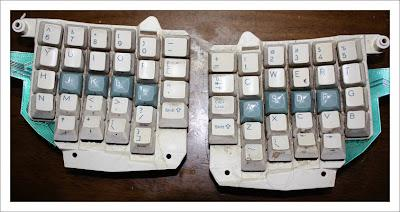
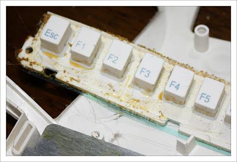
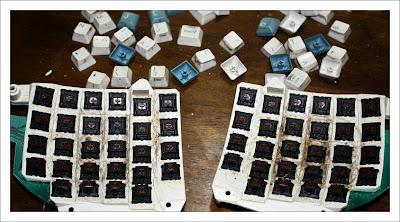
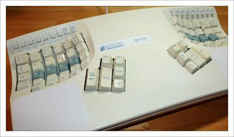

+++
title = "Keyboard Cleaning"
slug = "2011-05-14-keyboard-cleaning"
published = 2011-05-14T11:22:00+09:00
author = "David Dibben"
tags = []
+++
I really like my [Kinesis](http://www.kinesis-ergo.com/) Ergo Elan
keyboard which I bought about 12 years ago. It is old enough to have a
5-pin DIN connector with PS-2 adapter, which is now plugged into a PS-2
to USB  converter. I use it at work, so it has had more than 10 years of
continuous use without any real problem. However, it was starting to
look a bit grotty and the escape key was a bit sticky. Then the other
day some keys stopped working so I thought it was time for a good
clean.  
  
The only way to get all the muck out was a complete disassembly.
Fortunately, the Kinesis keys come off fairly easily. The cause of the
sticky escape key was very obvious once it was dissasembled - some
sticky mess all around the contacts.  Most of the keyboard is screwed
together but the function keys were held in place by plastic lugs which
had been melted over the backing plate. Not a good design for easy
disassembly. So it was necessary to cut of the top of the lug to take
the function key assembly apart and then glue it back together.  
  

<table>
<tbody>
<tr class="odd">
<td style="text-align: center;"></td>
</tr>
<tr class="even">
<td style="text-align: center;">The keys before cleaning</td>
</tr>
</tbody>
</table>

  

<table>
<tbody>
<tr class="odd">
<td style="text-align: center;"></td>
</tr>
<tr class="even">
<td style="text-align: center;">Something disgusting on the function keys </td>
</tr>
</tbody>
</table>

Once all the keys were removed, they could be cleaned and all the grot
removed from underneath them.  
  

<table>
<tbody>
<tr class="odd">
<td style="text-align: center;"></td>
</tr>
<tr class="even">
<td style="text-align: center;">Key switches with keys removed. </td>
</tr>
</tbody>
</table>

  
  
The keyboard cleaned up pretty nicely. The plastic is slightly yellowed
and the legend on the "enter" key is slightly faded, but considering the
use that this keyboard has had it is in remarkably good repair. I have
just ordered the newer model (the Kinesis Advantage) for use at home, to
replace the Microsoft Natural keyboard that I have been using.  
  

<table>
<tbody>
<tr class="odd">
<td style="text-align: center;"></td>
</tr>
<tr class="even">
<td style="text-align: center;">The cleaned keyboard</td>
</tr>
</tbody>
</table>
