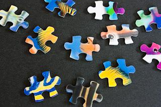

+++
title = "The knowledge jigsaw"
slug = "2012-08-11-the-knowledge-jigsaw"
published = 2012-08-11T21:09:00.002000+09:00
author = "David Dibben"
tags = []
+++

  

  

Most of my colleagues don’t  read books.  They are
software developers in desparate need of improving their skills yet they
try to get by with muddling through with what they already know or
relying on the boss to provide the information they need. This has
puzzled and frustrated me for some time. If they were using some other
means to learn – blogs, personal contacts, seminars then I could
understand but they don’t do that either. Yet when I talk to them they
all profess to wanting to improve their skills and knowledge. 

  

One common aspect that came up in conversations is
that they seem to expect a book to be both directly relevant to them and
to answer whatever specific problem they are having at the moment.  Of
course, this is rarely the case. When they read one book, do not
understand the context and can’t apply whatever the book describes
directly they dismiss it as not relevant and a waste of time. This then
puts them off technical books in general.

  

To try and explain why they should read I now use the
metaphor of a jigsaw puzzle. Reading an article or book is like picking
up a single piece of the puzzle. Sometimes you  can see something
recognizable on the piece and see how it fits. More often the picture on
the piece only makes sense when it is seen in the context of the
surrounding pieces. 

  

To understand most technical books you need to
understand the context. You get the context through experience and
through reading widely. 
