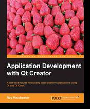

+++
title = "Application Development with Qt-Creator"
slug = "2014-02-02-application-development-with-qt-creator"
published = 2014-02-02T15:30:00+09:00
author = "David Dibben"
tags = []
+++

  
Packt sent me a copy of their new book on using Qt-Creator ["Application
Development with
Qt-Creator"](http://www.packtpub.com/application-development-with-qt-creator/book) 
by [Ray
Rischpater](http://www.packtpub.com/authors/profiles/ray-rischpater).
 It is very clearly targeted at beginners and anyone with experience of
other IDEs would probably find it too light. However, if you are
completely new to programming it covers some of the basics of using
Qt-Creator, but not really enough to create an actual application.  
  
This is not a book for learning C++ or Qt. The code samples are very
simple. There is section on how to use Qt's signals and slots but many
of the topics needed for non-trivial applications are not even mentioned
(for example the more advanced widgets such as lists, tables,
combo-boxes or event handling.) Fortunately, Qt has comprehensive
documentation that covers most of this.  
  
The biggest problem that I had with this book was what was missing. Many
of the functions that I use the most while programming were not
mentioned at all. One of Qt-Creator's strengths is the C++ code model
that allows fast navigation. You can find all the places a function is
used (Ctrl+U), follow a symbol to where it is declared/defined (F2) and
switch between header/source files (F4). This makes navigation in a
large code base fast and easy. But these functions did not seem to be
covered. Also, the following basic topics are not covered:  
  

-    Search and replace
-    The different views in the left hand pane (class view, open
    documents etc)
-    Splitting the main editor window to view two files at the same time
-    Editor functions such as commenting out a block of code
-    Shortcut keys
-    Refactoring functions for renaming symbols / extracting functions
-    Code snippets

  
For anyone familiar with an IDE these are all straight forward and easy
to use. However, if you are new to programming (and are therefore in the
target audience for this book) then you might want a bit more
explanation and description of the available functions.  
  
The really big omission is a description of the location function
(Ctrl+K). This function is central to using Qt-Creator and, for me, what
makes Qt-Creator stand out as an IDE. The location field in the bottom
left of the screen has many functions. Just typing a filename allows
quick opening of any file in the project. It also gives access to the
help system, the source control functions, lists of classes and member
functions.  Since this is something that sets Qt-Creator apart it almost
deserves a whole chapter by itself, but it is not even mentioned.  
  
The lack of coverage of major functions actually suggests that the
author has not actually used Qt-Creator for any serious development and
has not used Qt significantly either. Slots can be private (or
protected) contrary to what is claimed in the book.  
  
The overall impression is one of a professional writer who has not
actually used Qt-Creator for any real development. So the writing is
clear and easy to follow but the coverage of the topic is very
superficial.  
  
If you just want to quickly learn how to setup Qt-Creator, for example
to complete a class assignment, then this book covers what you need.
 For professional developers on larger projects this book is missing
coverage of too many functions.
