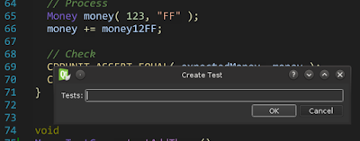

+++
title = "Using CppUnit with QtCreator."
slug = "2016-05-04-using-cppunit-with-qtcreator"
published = 2016-05-04T20:47:00.001000+09:00
author = "David Dibben"
tags = []
+++
We have been using
[CppUnit](https://www.freedesktop.org/wiki/Software/cppunit/) for many
years and have a large set of tests in CppUnit and so wanted to continue
using the CppUnit framework while using
[QtCreator](https://www.qt.io/ide/) as the IDE. QtCreator has a plugin
for using the Qt test framework but changing test framework would be a
lot of work.  
  
The basic goals were  

-   automatically run tests when the code is built
-   Have test failures show up in the Issues window of QtCreator 
-   Easily add new tests

  

### Running the tests

This example is based on the Money example code from CppUnit. The MoneyTest
file was renamed MoneyTestCase
to match the conventions we use.  
  
To use QtCreator with the money example, the first task was to create a
simple qmake .pro file for the project  
  

     TEMPLATE = app  
     TARGET = cppunit-test  
     INCLUDEPATH += .  
     HEADERS += Money.h \  
       MoneyTestCase.h  
     SOURCES += MoneyApp.cpp \  
       MoneyTestCase.cpp  
     LIBS += -lcppunit  

  
  
This compiles and the tests can be run:  
  

    Starting /home/dibben/Develop/QtCreator/cppunit-test/cppunit-test...
    ....
    OK (4)

  
  
But we want to run the tests automatically when they are built. So we
add a custom process step.  
  

  
  
Now when we type "Ctrl+B" to build the project the tests are
automatically run.  
  

### Getting the test failures

When using the default outputter, if a test fails, we get a message such
as:  
  

    ..F..
    MoneyTestCase.cpp:52:Assertion
    Test name: MoneyTestCase::testEqual
    assertion failed
    - Expression: money123USD != money123FF
    Failures !!!
    Run: 4   Failure total: 1   Failures: 1   Errors: 0

  
  
But we want this to appear in the Issues list of QtCreator with a link
to the test that failed.  
  
To do this we need to change the output format of CppUnit. This requires
changing the MoneyApp.cpp
code to use the basic test runner and adding a new outputter. The
main function now looks like this:  
  
  

      CPPUNIT_NS::TestResult controller;  
      // Add a listener that colllects test result  
      CPPUNIT_NS::TestResultCollector result;  
      controller.addListener( &result );  
      // Add a listener that print dots as test run.  
      CPPUNIT_NS::BriefTestProgressListener progress;  
      controller.addListener( &progress );  
      // Add the top suite to the test runner  
      CPPUNIT_NS::TestRunner runner;  
      runner.run( controller );  
      runner.addTest( suite );  
      // Run the test.  
      runner.run(controller);  
      bool wasSucessful = result.wasSuccessful();  
      // Print test in a compiler compatible format.  
      #ifndef _WIN32  
          GccOutputter outputter( &result, std::cerr );  
      #else  
          MSVCOutputter outputter( &result, std::cout );  
      #endif  
      outputter.write();  

  
This will collect the results in the result object
and then print them at the end of the run using either the GccOutputter
or MSVCOutputter.
These are modified versions of the Compiler outputter that produce
output that QtCreator can interpret. Building this will now produce the
following output in the Compile window  
  

     18:57:46: Starting: "/home/dibben/Develop/QtCreator/cppunit-test/cppunit-test"  
     MoneyTestCase::testConstructor : OK  
     MoneyTestCase::testEqual : assertion  
     MoneyTestCase::testAdd : OK  
     MoneyTestCase::testAddThrow : OK  
     MoneyTestCase.cpp:52: error: - Expression: money123USD != money123FF  
     Failures !!!  
     Run: 4  Failure total: 1  Failures: 1  Errors: 0  
     18:57:46: The process "/home/dibben/Develop/QtCreator/cppunit-test/cppunit-test" exited with code 1.  

  
and QtCreator will pick up the error and display it in the Issues output
pane:  
  

  
  
  
So now when the code is built the tests will be run automatically and
any errors will show up in the Issues pane linked to the source line for
the failed test.  
  
The code GccOutputter and MSVCOutputter is available on Github
[here](https://github.com/dibben/cppunit-utilities).  
  

### Adding a new test

  
The money example uses a separate header and source file for the test
cases. This means that to add a new test we need to do 3 things  
  

1.  Add a declaration in the header
2.  Add a definition in the source file
3.  Add the test to the test suite using the CPPUNIT\_TEST macro.

  
  
Some of the newer frameworks make this easier but we are using CppUnit.
To make this simple in QtCreator I created a plugin that adds some
support functions for Cppunit. The plugin is available on
[Github](https://github.com/dibben/qt-creator-cppunit-plugin)  
  
With the plugin creating a new test is as simple as Ctrl+Shift+T, then a
dialog appears for the name of the new test. Multiple tests can be
entered separated by spaces. On clicking OK this does the 3 steps above
to add the test to both the header and the source file.  
  

  
  
The plugin has some other functions as well  
  

-   Create new tests
-   Create a new test case class (custom class wizard)
-   Switch between source and test case

  
  
  

### References

  

-   CppUnit Outputter classes on Github:
    [cppunit-utilities](https://github.com/dibben/cppunit-utilities)
-   QtCreator plugin for Cppunit test creation on Github:
    [qt-creator-cppunit-plugin](https://github.com/dibben/qt-creator-cppunit-plugin)
-   Source code for the example:
    [cppunit-test.zip](https://s3.amazonaws.com/codegardening/cppunit-test.zip)
