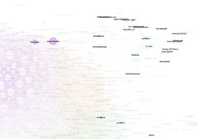
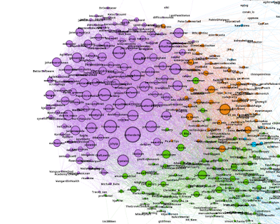
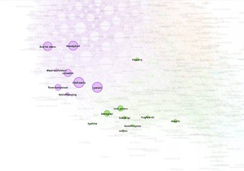

+++
title = "Analysing My Twitter Network"
slug = "2020-05-24-analysing-my-twitter-network"
published = 2020-05-24T11:43:00.002000+09:00
author = "David Dibben"
tags = [ "PKM",]
+++
I have been on twitter for more then 10 years, but normally use it as a
source of information, just reading tweets rather than for
conversations. As part of [@hjarche](https://twitter.com/hjarche)'s [PKM
workshop](https://jarche.com/pkm/pkm-workshop/)  I thought it would be
interesting to look at the connections between those that I follow on
twitter and see what networks exist.  
  
There seem to be [many
tools](https://buffer.com/library/free-twitter-tools) for analysing
twitter followers demographics  and for analysing tweets but not so many
for looking at networks of those you follow (at least that I could find
with a Google search).  
  
However, I found a series of [Python
scripts](https://github.com/alumbreras/twitter-followers-graph) that
extracts connections between followers of followees. This process is
very slow because twitter rate-limits the access to its API to 15 calls
in 15 minutes. So extracting the information for the 600 people I follow
took 10 hours.   It also requires [access
tokens](https://python-twitter.readthedocs.io/en/latest/getting_started.html)
which means signing up for a Twitter developer account.  
  
The output from the scripts is a CSV file suitable for use with
[Gephi](https://gephi.org/). I had not come across Gephi before, so this
process also introduced me to a new graph analysis tool which might help
with another of my problems, that of looking at the dependencies between
a lot of software modules in a large program.  
  
The process with Gephi is to load the graph file from the Python scripts
and then runs some analysis and use the automatic layout algorithms to
layout the graph. I found a
[tutorial](https://gephi.org/tutorials/gephi-tutorial-quick_start.pdf)
that explains the basic details.  
  
  
This produced a graph for those I follow on twitter like this:  


  
The nodes on the graph are the people I follow on Twitter. The edges in
the graph are the followship links between these people. The size of the
nodes depends on how many connections there are to that node.  
  
The "modularity analysis" found 6 "communities" based on the connection
information, this is represented by the different colours. However
looking at the graph, 8 different main groups seem to exist.  
  
  

1.  This is the main group I follow mostly software development related,
    especially agile software.
2.  This is also technical but seems to form a different group from 1.
3.  This group consists of twitter personalities, or more business
    related topics.
4.  These are Japanese software developers.
5.  This small group is a technical niche for 3D CAD
6.  This group is related to Japan so is mostly separate from other
    groups
7.  Photography related
8.  Japanese Jazz artists

  
  
The lack of connection between groups 4 and 8 and the rest does not
surprise me due to the language difference. These groups tweet in
Japanese whereas the rest are English. Even though the Japanese
developers have a strong interest in "agile software development" there
are few links to the non-Japanese developers I follow:  
  

It is clear that the main group I follow is the "software development"
group. I it is interesting to me that the analysis algorithm split this
into two groups.  
  

  
  
Since this exercise was prompted by the PKM workshop I looked at the
people that [@hjarche](https://twitter.com/hjarche) and myself both
follow. I was surprised that there are only a few that be both follow:  
  

  
I am not sure where to go from here. My list of follows needs some
pruning. Also, some areas need expanding.  
  
This analysis just looks at connections between people, not at how often
they tweet. The timeline tends to be dominated by a small number of
prolific tweeters / re-tweeters so some of the conversations in the main
groups probably get drowned out.  
  

### Links

  

-   PKM Workshop: <https://jarche.com/pkm/pkm-workshop/>
-   Gephi: <https://gephi.org/>
-   Egonet Scripts:
    <https://github.com/alumbreras/twitter-followers-graph>

  
  
Note, the README description for the scripts is out of date.  
The name of the script has changed and the commands are now:  
  
`   python egonet.py -u username -f followees python egonet.py -u username -f followees_graph`
